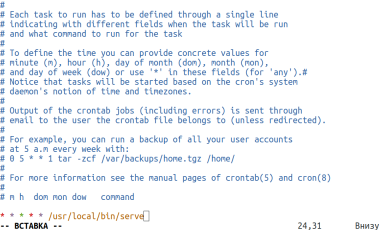

## Using the **CRON** job scheduler
CRON is a daemon program. Its main task is to perform user-specified processes at user-specified times, e.g. at certain intervals.

Let's take a look at the syntax for setting up a single cron job: \
`minute hour day month weekday /execution/file/path`

It has to be said that it is necessary to write the full path to the command, because the PATH environment variable will be different for commands run under the cron. The date and time are specified using numbers or the '*' symbol. This symbol means that the process must be executed every time.

Cron settings examples:
- First, you can view the cron tasks for the superuser, for this you can run the crontab –l command: \
  * 
- You can remove all the existing tasks with -r command
- The simplest example would be to run some process every minute with `* * * * /usr/local/bin/serve` command: \
  * 
- You can select any minute, hour and day of the week, for example 15.30 on Tuesday: `30 15 * * 2 /usr/local/bin/serve`
- Besides that, there are special variables for some frequently used sets, here they are:
  - @reboot -- at boot, only once
  - @yearly, @annually -- once a year
  - @monthly -- once a month
  - @weekly -- once a week
  - @daily, @midnight -- every day
  - @hourly -- every hour
  
- For example, the script is run once an hour with `@hourly /usr/local/bin/serve` command : \
  * 
