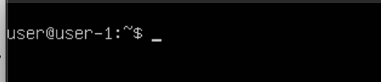
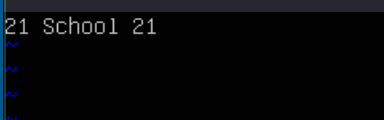
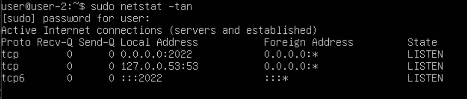

/* clang-format off */

## Part 1. Установка ОС
* Версия Ubuntu
* 

## Part 2. Создание пользователя
* Создание и добавление нового пользователя в adm
* 
* Вывод команды cat /etc/passwd
* 
* Проверка групп пользователя
 * 

## Part 3. Настройка сети ОС
* **_Задай название машины вида user-1._**
 * 
*  Перезапускаем систему для отоброжения 
 * 
* **_Установи временную зону, соответствующую твоему текущему местоположению._**
 * 
* **_Выведи названия сетевых интерфейсов с помощью консольной команды._**
 * 
* * lo - зацикленный интерфейс для передачи данных между процессами в самой системе; 
  * enp0s8 - Ethernet-интерфейс, сетевой адаптер для машины; 
* **_Используя консольную команду, получи ip адрес устройства, на котором ты работаешь, от DHCP-сервера._**
 * 
* * DHCP (Dynamic Host Configuration Protocol), нужен для выдачи ip устройствам сети
* **_Определи и выведи на экран внешний ip-адрес шлюза (ip) и внутренний IP-адрес шлюза, он же ip-адрес по умолчанию (gw)._**
* * Получения внешнего ip роутера
 * 
* * внутренний IP-адрес шлюза, он же ip-адрес по умолчанию (gw)
* 
* **_Задай статичные (заданные вручную, а не полученные от DHCP-сервера) настройки ip, gw, dns (используй публичный DNS-серверы, например 1.1.1.1 или 8.8.8.8)._**
* * Находим файл с настройками сети и dhcp для их изменения
* 
* * Записываем в него нужные статические данные ip, gw, dns
* 
* **_Перезагрузи виртуальную машину. Убедись, что статичные сетевые настройки (ip, gw, dns) соответствуют заданным в предыдущем пункте._**
* * Применяем изменения после перезагрузки
* 
* 
* * Успешно пропингуй удаленные хосты 1.1.1.1 и ya.ru и вставь в отчёт скрин с выводом команды. В выводе команды должна быть фраза «0% packet loss»
* 

## Part 4. Обновление ОС
* **_Обнови системные пакеты до последней на момент выполнения задания версии._**
* 

## Part 5. Использование команды sudo
*  Используем юзера user с правами на sudo, командой sudo visudo открываем файл и редактируем, добавляем всего одну строчку puppy ALL=(ALL) NOPASSWD: ALL
* 
*  Сменяем пользователя  и проверка прав доступа
* 
*  Применяем sudo юзером puppy для смены имени хоста и перезапускаем машину
* 
* Удостоверяемся в применении изменений
* 

## Part 6. Установка и настройка службы времени
* Вывожу время и часовой пояс. и проверяю наличие "NTPSynchronized=yes:"
* 

## Part 7. Установка и использование текстовых редакторов
* **_Используя каждый из трех выбранных редакторов, создай файл test_X.txt, где X — название редактора, в котором создан файл. Напиши в нём свой никнейм, закрой файл с сохранением изменений._**
* sudo apt-get install vim nano mc - скачиваем редакторы
* В vim нажимаем i для записи, esc для прекращения записи, :wq + enter для выхода
 * 
* В nano после записи нажимаем ctrlX + y + enter
 * 
* В mcedit после записи для сохранения нажимаем fn + f2 + enter  для выхода fn + f10
 * 
 * **_Используя каждый из трех выбранных редакторов, открой файл на редактирование, отредактируй файл, заменив никнейм на строку «21 School 21», закрой файл без сохранения изменений_**
 *  Для выхода без сохранения в vim используем :q!
* 
 *  В nano для той же цели ctrlX + n
* 
 *  В mcedit - fn + f10 + "нет"
* 
 * **_Используя каждый из трех выбранных редакторов, отредактируй файл ещё раз (по аналогии с предыдущим пунктом), а затем освой функции поиска по содержимому файла (слово) и замены слова на любое другое._**
 * / в vim используется для поиска слова
* 
 * Такая конструкция заменяет все вхождения слова в vim
* 
 * Для поиска слова nano использует ctrl + W
* 
 * Для замены - option + R
* 
* 
* 
 * В mcedit используется fn + f7
* 
 * Аналогично fn + f4 + enter для замены
* 

## Part 8. Установка и базовая настройка сервиса SSHD
* **_Установи службу SSHd._**
* Для установки ssh пишем sudo apt-get update && sudo apt-get install openssh-server
* Добавление автостарта shh сервиса
* 
* Запускаем командой sudo systemctl start sshd если не запустился
* Проверяю статус
* 
* Находим файл sudo nano /etc/ssh/sshd_config и меняем порт с 22 на 2022, убираем # в начале строки
* 
* Перезапускаем сервис sudo systemctl restart sshd и проверяем изменения порта
* 
* **_Используя команду ps, покажи наличие процесса sshd. Для этого к команде нужно подобрать ключи._**
* Используем ps aux | grep sshd для вывода инф. о sshd процессах *ps дает информацию о процессах, ключи a (для всех юзеров), u (с инфо о юзере), x (фоновые тоже) *grep shhd фильтрует вывод по слову "sshd" 
* 
* **_Перезагрузи систему._**
* Перезапускаем систему sudo reboot
* 
* Используем sudo netstat -tan (ключи: показ tcp соединений, прослушивающих портов, чисел портов и ip) tcp - transmission control protocol, протокол передачи данных; receive и send queue - очередь отправки и приема, пуста, тк не отправлены и не получены никакие данные; Local address: 0.0.0.0 - это особый ip для обработки запросов с любого сетевого интерфейса устройства; Local address: 2022 - указанный номер порта, где сервер ожидает соединение; Foreign address (0.0.0.0:) - принимающий адрес,  означает доступ для любых ip и портов; Listen - прослушивание, состояние обработки запросов

## Part 9. Установка и использование утилит top, htop
* **_Установи и запусти утилиты top и htop_**
*  Используем top для просмотра рабочих процессов, изучаем данные
* 
* * Время работы с перезапуска - up 51 min
* * К-во юзеров - 1; средняя нагрузка за последнее время (1 мин, 5 мин, 15 мин): 0,00 0,00 0,00
* * Всего процессов в работе - 107
* * %Cpu(s): 0,0 us, 0,0 sy, 0,0 ni, 100,0 id, 0,0 wa, 0,0 hi, 0,0 si, 0,0 st - нагрузка на процессор
* * MiB Mem: 4083,6 total, 3687,7 free, 153,1 used, 241,8 buff/cache - загрузка опер. памяти
* * MiB Swap: 2814,0 total, 2814,0 free, 0,0 used, 2780,2 avail Mem - загрузка своп-памяти
* * pid процесса с наибольшим исп. памяти (0,6) - 438 (root)
* * pid процесса с наибольшим исп. времени процессора (0,4) - 651 (root)
* Такой результат выводит команда htop, его нужно отсортировать
 * 
* * Используем f6 для выбора сортировки по pid
 * 
 * * Аналогично для cpu
  * 
* *  Аналогично для mem
 * 
* * Аналогично для time
 * 

* * Фильтрация для процесса sshd иначе осуществляется - с f4 и вводом sshd
 * 
* * Поиск для syslog работает по f3
 * 
* * Добавление hostname, clock и uptime происходит в настройках f2
 * 

## Part 10. Использование утилиты fdisk
**_Запусти команду fdisk -l._**
 * 
* * Имя диска /dev/sda, емкость 30 GiB, model: HARDDISK, 62914560 секторов.
* * swapon --show используем для получения данных о свопе, 2,8G.

## Part 11. Использование утилиты df
* Используем команды df / и df -Th / для просмотра состояния диска корневой системы 
* Для первой команды размер раздела - 13798872 блоков по 1 Кбайт (1k-blocks)  Используемое пространство - 5380344 блоков, свободное - 7695792 блока, в процентах - 42% 
* Для второй команды размер составил 14 Гб, занято пространство 5,2 Гб, свободное - 7,4 Гб, в проц. 42% 
* Тип системы указан как ext4
* 

## Part 12. Использование утилиты du
* Используем sudo du -s и -sh для вывода размеров папок; s отвечает за вывод суммарного размера, h - за удобный формат чтения
* 
* Для вывода размера каждого элемента в /var/log используем sudo du -ah
* 

## Part 13. Установка и использование утилиты ncdu
* sudo apt update && sudo apt install ncdu для установки ncdu
* ncdu /home, выход через ctrlC
 * 
* ncdu /var
 * 
* /var/log
 * 

## Part 14. Работа с системными журналами
* Вручную открываем sudo less указанные файлы и ищем информацию о последнем вхождении в систему; на скрине представлен файл auth.log, где видны все необходимые данные
* 
* Последний логин: 5 июня 15:52:24, юзер - user, метод вхождения - login (подразумевает локальный вход)
* После перезапуска systemctl restart sshd находим записи об этом в том же файле
* 

## Part 15. Использование планировщика заданий CRON
* **_Используя планировщик заданий, запусти команду uptime через каждые 2 минуты._** 
* Записываем после sudo crontab -e задачу для cron,проверяем работу через четыре мин.
 * 
 * 
* crontab -l отображает содержимое файла, активные задачи, crontab -r стирает все задачи
 * 
 * 